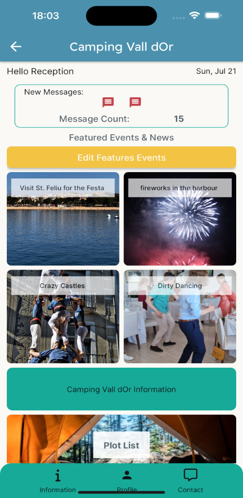

+++
title = 'Spondycode_apps'
date = 2024-08-13T22:15:07+02:00
+++

## I have been working like mad to make apps

I started learning Flutter and Dart and then I found FlutterFlow. FlutterFlow is amazing for quickly making apps. It seemed a bit daunting to begin with but I really got into the swing of it. Adding authentication and using databases to provide the dynamic content for an app is getting easier. I think there are still parts I have not discovered yet but that is part of the fun of it.

I started by making a app which I had already done with Python and Django. I liked working with it but I found the writing it all manually tedious. So many times I seemed to have to write the same bit of code over and over. Now that I have FlutterFlow I can put so much of it in with drag and drop and I think it is the direction of creating with code. I mean you have tools like code completion and CodePilot to help make the coding easier. Why not take it a step further and let the IDE write much of the software for you. You drop in a component on your page and FlutterFlow gives you access to all the settings and preferences to make the object your own design.

## Still Miss working with Django though

I spent a lot of time learning and working with Django and in the end what moved me away from it is that I would have to learn another one or two languages to get the mobile apps I needed. I didn't want to spent the same amount of time with Swift in Xcode and Kotlin for the Android apps. So finding FlutterFlow has been fantastic. I only wish I could have found it sooner. Having said that, I did learn much about the way of thinking in code to be able to get the logic of an app worked out. The time I spent with Python and Django wasn't wasted.

With FlutterFlow I can also make web apps and apps which will run on a Mac. Covering most of the bases there. I wonder if the ability to make Windows apps will arrive on the scene at tome point. 

## Cost of doing business

I've still not made any money with my code efforts yet but it's getting closer. I'm spending on the monthly fee for using FlutterFlow and I went with the Pro version in the end because it makes it so much easier with deploying the apps on the app stores. Well, at least it is going well with the iOS end of things. I have got stuck with Google Play store for the moment. I will have to ask for help. I am nearly to the point of having my iOS app on the Apple App Store. Just a few sticky deployment things to sort out. At least getting the app into Testflight has been super easy.

## Started using other Terminal apps

I bounce between iTerm2 and Warp usually but recently I have tried Alacritty and Kitty. Warp is handy because it has some AI built into it. Sometimes though I find that gets in the way. I might also have a look at Westerm. 

